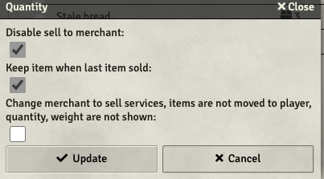
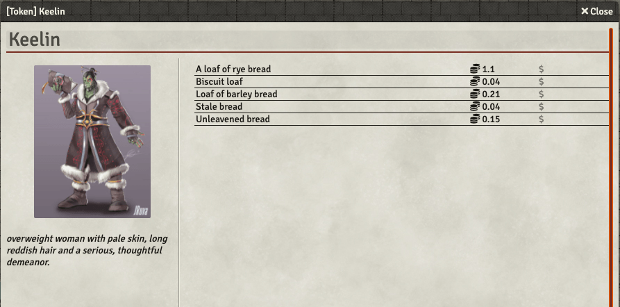

## Version 2.3.3
* Add japanese localization
* Fix WFRP CSS for category names #87
* 
## Version 2.3.2
* Fixed CSS issues for merchant sheet #80
* Fixed translations for German

## Version 2.3.1
* #78 WFRP: CSS bug in other sheets
* #77 WFRP: Not enough cash but still get item
* #76 WFRP: Missing Names
* #75 WFRP: Trappings Subcategories
* #75 WFRP: Missing Trappings

## Version 2.3.0
* Added support for WFRP

## Version 2.2.0
* Add functionality for add button 
* Enable csv import to create unknown items, this is enabled by default.
* Added settings to disable sell item to merchant
* Added settings to keep depleted item on merchant for the GM to easy change the quantity later
* Added settings to enable a service merchant. Like a butcher or tavern or church

* Changed merchant to service if enabled

## Version 2.1.5
* Fix problem with selling items. The sell dialog was disabled. It should now work again

## Version 2.1.4
* Fix problem with Monks Tokenbar conversion to lootTable. Thanks IronMonk for pointing to _sheet instead of sheet

## Version 2.1.3
* Added How to use documentation
* Fix Stack modifer
* Fix set for all items if roll formula is empty

## Version 2.1.2
* Fix that new merchants was not initialized correct with the modifiers. 

## Version 2.1.1
## Version 2.1.0
* Changed button layout 
* Added a fast way to set quantities for all items. Possible to set infinity for all items in store
* Fixed bug with trying to sell or buy an item that have a quantity of 0. 

## Version 2.0.1
* Fixes the problem with NaN issue on merchant sheet #59

## Version 2.0.0
* Changed to typescript. After upgrade remember to select the sheet again on the tokens
* Added a csv parser, remember to not have header field in the pasted content
* Fixes for dnd5e 1.5, This version does not support dnd5e 1.4
* Fixes unlimited quantity and a weight less than 1 glitch #50

## Version 1.5.3
* Added missing translations in german and danish

## Version 1.5.2
* Changed to non deprecated method for infinity quantity. Hope this will fix the problem with missing inventory. Could not reproduce #55
* Added | as seperator for csv input. As some have tried with that. So now with or without " around values with | will work. 

## Version 1.5.1
* Fixed buy bugfixes for GM and NO GM options

## Version 1.5.0
* Added support for CSV import and add from compendiums. Select item/spell compendiums to use in settings
* No GM required when players interact option.

## Version 1.4.4
* Fixed Bug with initializing of "sell to merchant modifier" which set the "buy from merchant modifier" to 50%.

## Version 1.4.3
* Fixed Modifiers initialization problems (#50)

## Version 1.4.2
* Fixed drag drop show sell dialog for non merchants

## Version 1.4.1
* Added missing translations
* Fixed width of columns and buttons misaligned

## Version 1.4.0
* Added danish and german translations

## Version 1.3.0
* Possible to expand description of an item (#22)
* Both modifiers can now be set to zero. (#36)

## Version 1.2.3
* Forgot to merge in the PR.

## Version 1.2.2
* Fixed module.json

## Version 1.2.1

* Possible to drag spells to dnd5e sheet now, it will create a spell scroll (#18)
* It is now changed so a player can't change the quantity or price on a merchant item (#26)
* The currency name in Swade settings are now used in chat messages (#31)

## Version 1.2.0 

* Fixed problems with merchant permissions. Now either a player have access to it or not. The player will not own the merchant (#27) and (#26)
* Fixed sorting in categories. The sorting is now working. (#25)
* Added Starfinder support (#28)

## Version 1.1.5 

* Fixed problems with quantity and currency in sell and buy functions when it needs to be updated. 
* Fixed decrease of quantity on merchant, so it would not set it to undefined.

## Version 1.1.4
* Added Flavor text on the merchant 

* Fixed bug with selling and buying in swade 0.8.6 
* Fixed bug with deleting items in 0.8.6

## Version 1.1.3

* Fixed bug with some of the itemtypes in dnd5e. 

## Version 1.1.2

* Changed buy/sell modifier text for better understanding

## Version 1.1.1

* Small UI fixes
* Fix Swade selling to merchant

## Version 1.1.0

* Fixed 0.8 support

## Version 1.0.0

* Possible to sell to merchant as well. The percentage of the items price can be set for all items on a merchant. Default is 50%. Dialog is shown to seller where seller can choose quantity of items to sell and cancel if price is too low. 
* Able to delete items on merchant as GM
* Bugfix: Fixed Swade problem with deducting currency when purchasing items

## Version 0.2.0

* Base price on itmes can be set
* Able to modify quantity on itme even set it to unlimited.
* Bugfix: Able to buy stack again
* Bugfix: Able to see price on items

## Version 0.1.0

* Categories is now implemented for both Dnd5e and Swade.  

## Version 0.0.6

* Used Loot sheet 5e calculations for dnd5e version of merchant. So now dnd5e is supported as well. 

## Version 0.0.4

* Added multi system base for currency calculation. Also fixed some small bugs for Swade purchases.

## Version 0.0.3

* Fixed Css for both Swade and dnd5e. Images and text is now alligned. 

## Version 0.0.2

* Added stack modifier. This sets how many a player can buy with the stack button.
* Fixed css for dnd5e style. The image resize was not correct. Still trying to find the problem in Swade.

## Version 0.0.1

Initial release. Modified the lootSheet to only be a merchant sheet removed the dnd5e system relation