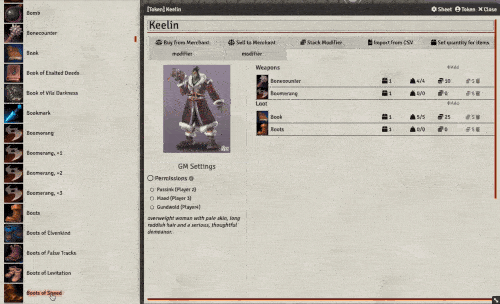
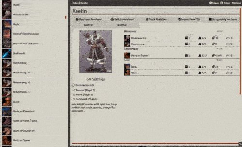
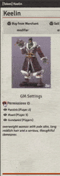

 
# Merchant Sheet NPC

This module adds an additional NPC sheet that can be used for Merchant NPCs. 

This version was originally forked from ChalkOne's loot-sheet module. 
The development for the merchant sheet will be intended for only making it easy for the GM to setup merchants dialog 

## Features

Allows for easy making a shopkeeper that can be displayed to the players. 

More features detailed below.
### GM Actions
Here are how the GM can use the merchant sheet

#### Set Items for sale
You can drag drop items from compendiums into the merchant sheet. It will automatically sort the items under the categories and have them ordered by name.

Another possibility is to use the CSV import. THis requires an compendium is already setup as a base item compendium to find the items in. 

It is also possible to remove item from sale by using the trash icon on the item. 

#### Change the quantity for item
You can change the quantity on an item by clicking on the quantity icon. 

Another way is to set the quantity for all items at once. Either set them to unlimited or a dice formula. If a number is entered here. That number will be used on all items. 

#### Change permissions for merchant to players
The players can either have the possibility to interact with ther merchant or not. It is up to the permissions set on the merchant sheet. An Eye means the player have access a cirle means the player does not have access.

#### Change Modifers
You can change the buy from merchant modifier, sell to merchant modifier or stack modifer. The stack is how big a stack of items a player can buy

### Player actions
Here are the things a player can interact with the merchant

#### Buy item from merchant
A player can buy an item or a stack of items from a merchant

#### Sell item to merchant
A player can sell an item to a merchant by using the drag drop functionality. If that is used the player either accept or decline the price. The GM can modify the price again and the player tries again. Maybe the new price is accepted

At the moment the mercant have unlimited amount of money.

## Compatibility:
- This works only in FVTT 0.8.x and with these systems (maybe more if the system is using simple quantity): 
  * swade
  * dnd5e  
  * Starfinder 

## Installation Instructions

To install a module, follow these instructions:

1. Start FVTT and browse to the Game Modules tab in the Configuration and Setup menu
2. Select the Install Module button and enter the following URL: https://raw.githubusercontent.com/whelan/fvtt-merchant-sheet-npc/master/module.json
3. Click Install and wait for installation to complete 

## Feedback

If you have any suggestions or feedback, please contact me on Discord (Whelan#7806).
